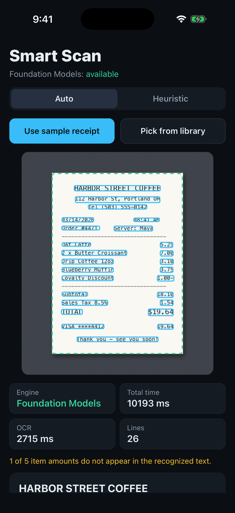
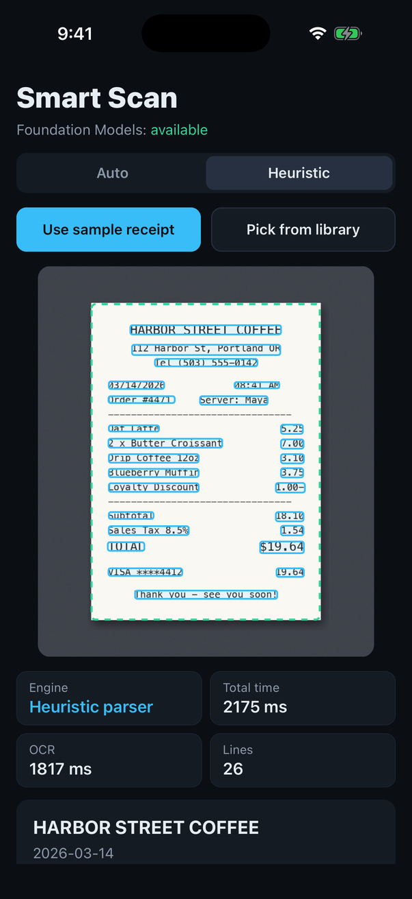
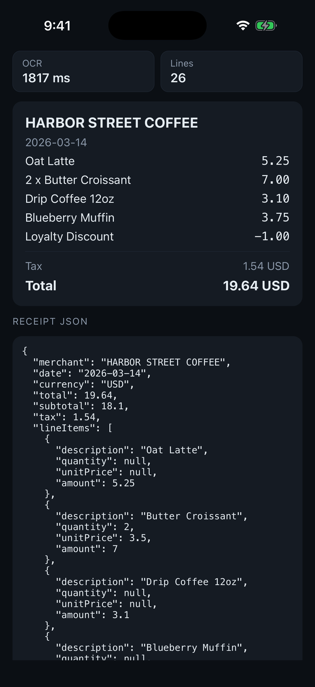
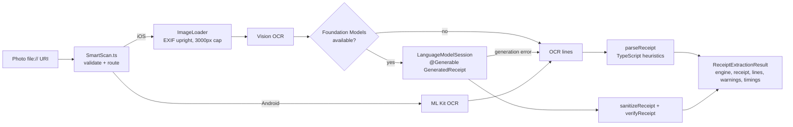

# expo-smart-scan

On-device receipt and document scanning for Expo: Vision / ML Kit OCR, document detection, and structured receipt extraction with Apple Foundation Models, with a tested TypeScript fallback everywhere else.

[](https://github.com/OwaisMunawar/expo-smart-scan/actions/workflows/ci.yml)
[](LICENSE)
[](#features)
[](https://docs.expo.dev/versions/v57.0.0/)

<p align="center">
  
  
  
</p>

<p align="center"><sub>Example app on the iPhone 17 Pro simulator (iOS 26.5). Left: Foundation Models, with one item amount flagged by <code>verifyReceipt</code>. Middle and right: the heuristic parser on the same image. The receipt is fictional, rendered by <code>scripts/make-sample-receipt.py</code>.</sub></p>

## Why

Receipt capture is a feature in expense, bookkeeping and loyalty apps, and most implementations
send the photo to a cloud OCR API. That costs money per scan, adds a network round trip and
means shipping financial documents off the device.

iOS 26 ships an on-device language model, and Vision and ML Kit already do good OCR offline.
This module wires them together behind one typed API and handles the unglamorous parts:
EXIF rotation, split price columns, model output that is well-formed but wrong, and a
deterministic fallback for every device that does not have Apple Intelligence.

## Features

| API                                                                          | iOS                                               | Android                            |
| ---------------------------------------------------------------------------- | ------------------------------------------------- | ---------------------------------- |
| `recognizeText(uri)`: lines, normalized boxes, confidence                    | Vision `VNRecognizeTextRequest`                   | ML Kit Latin (bundled)             |
| `detectDocument(uri)`: document quad                                         | Vision segmentation, rectangle fallback           | Not yet, rejects `ERR_UNSUPPORTED` |
| `extractReceipt(uri)`: merchant, date, currency, subtotal, tax, total, items | Foundation Models on iOS 26+, heuristic otherwise | Heuristic parser on ML Kit OCR     |
| `parseReceipt(lines)`: pure TypeScript                                       | Yes                                               | Yes                                |
| `getCapabilities()`                                                          | Yes                                               | Yes                                |

- **Engine selection with reasons.** `result.engine` is `foundation-models` or `heuristic`;
  when `auto` falls back, `fallbackReason` says why (`appleIntelligenceNotEnabled`,
  `modelNotReady`, `generationFailed:guardrailViolation`, `platform:android`, ...).
- **Model output is checked, not trusted.** Invalid dates and currencies are dropped, and
  `warnings` flags totals or item amounts that do not appear in the OCR text. The first
  screenshot shows this flagging an item amount the model got wrong.
- **Typed errors.** Every rejection is a `SmartScanError` with a stable `code`, identical on
  iOS and Android.
- **Upright coordinates.** Boxes are normalized, top-left origin, with EXIF rotation applied,
  so an overlay is `box.x * renderedWidth`.

```ts
import { extractReceipt, isSmartScanError } from 'expo-smart-scan';

try {
  const { receipt, engine, warnings, durationMs } = await extractReceipt(photo.uri);
  console.log(engine, receipt.total, receipt.currency, warnings);
} catch (error) {
  if (isSmartScanError(error, 'ERR_IMAGE_LOAD')) {
    // show "could not read that photo"
  }
}
```

## Architecture



Design decisions and the alternatives that were rejected are written up in
[docs/ARCHITECTURE.md](docs/ARCHITECTURE.md).

## Tech stack

| Layer            | Technology                                                                            |
| ---------------- | ------------------------------------------------------------------------------------- |
| Module framework | Expo Modules API (SDK 57), React Native 0.86                                          |
| iOS              | Swift 6, Vision, ImageIO, Foundation Models (iOS 26+, weak-linked)                    |
| Android          | Kotlin, ML Kit Text Recognition 16 (bundled Latin model)                              |
| Shared logic     | TypeScript (strict, `noUncheckedIndexedAccess`)                                       |
| Tests            | Jest via `jest-expo`, coverage thresholds enforced                                    |
| Tooling          | ESLint (`eslint-config-universe` + typed rules), Prettier, GitHub Actions, Dependabot |

## Quick start

```sh
git clone https://github.com/OwaisMunawar/expo-smart-scan && cd expo-smart-scan
npm install && (cd example && npm install)
cd example && npx expo run:ios
```

Tap **Use sample receipt**, or pick a photo. Foundation Models needs iOS 26+ with Apple
Intelligence enabled; on a simulator that depends on the host Mac. The module's deployment
target is iOS 16.4, where the heuristic engine is used. So far it has been run on the iOS 26.5
simulator; the Android side is compiled in CI but has not been run on a device yet.

The package is not published to npm yet. To use it in another app, install it from a local
path or a Git URL and run a development build (`npx expo run:ios`); it does not work in Expo Go.

## Quality

CI (`.github/workflows/ci.yml`) runs on every push and pull request:

| Job                    | What it runs                                                                                                           |
| ---------------------- | ---------------------------------------------------------------------------------------------------------------------- |
| Lint, typecheck, test  | `format:check` (Prettier), `lint` (ESLint, zero warnings), `typecheck` (library and example), `test:coverage`, `build` |
| iOS example build      | `expo prebuild`, `pod install`, `xcodebuild` for the simulator                                                         |
| Android module compile | `expo prebuild`, `gradlew :expo-smart-scan:compileDebugKotlin`                                                         |

Coverage thresholds: 95% lines / 85% branches for `src/parser`, 90% lines overall. Current
suite: 73 tests, 99% line coverage. The parser tests include messy OCR input: lookalike
digits (`l2.5O`), `$` read as `S`, labels split from their amounts, comma decimals, tender and
change rows, tax flags and discounts.

### Measured performance

| Measurement                                                                | Environment                                                              | Result                                              |
| -------------------------------------------------------------------------- | ------------------------------------------------------------------------ | --------------------------------------------------- |
| `parseReceipt`, 15-line receipt, 5,000 runs (`npm run bench`)              | Apple M2, Node 23                                                        | median 0.033 ms, p95 0.087 ms                       |
| `extractReceipt`, sample receipt, `engine: 'auto'` (Foundation Models ran) | iPhone 17 Pro simulator, iOS 26.5, Debug build, M2 host under heavy load | 8.2 s and 10.2 s total; OCR 2.2 s and 2.7 s of that |
| `extractReceipt`, sample receipt, `engine: 'heuristic'`                    | same                                                                     | 2.2 s total; OCR 1.8 s of that                      |

The simulator rows are one or two Debug-build runs each, on a heavily loaded machine. They show where
the time goes (the language model dominates, parsing is negligible) but they are not device
numbers; see the roadmap.

## Roadmap

- [ ] Device benchmarks on real iPhones (Release build), replacing the simulator numbers above.
- [ ] Android document detection (ML Kit Document Scanner or OpenCV contour detection).
- [ ] Android structured extraction with Gemini Nano via ML Kit GenAI where available.
- [ ] Prewarm the language model session so the first extraction is faster.
- [ ] Perspective correction: return a cropped, deskewed image for the detected quad.
- [ ] Camera frame processor integration for live scanning.
- [ ] Better support for right-to-left and CJK receipts in the heuristic parser.
- [ ] Publish to npm once the API has had real-world use.

## License

MIT, see [LICENSE](LICENSE). Contributions welcome, see [CONTRIBUTING.md](CONTRIBUTING.md).

Built by [Owais Munawwar](https://github.com/OwaisMunawar) — available for React Native, AI and iOS work on [Upwork](https://www.upwork.com/freelancers/owaism11).
